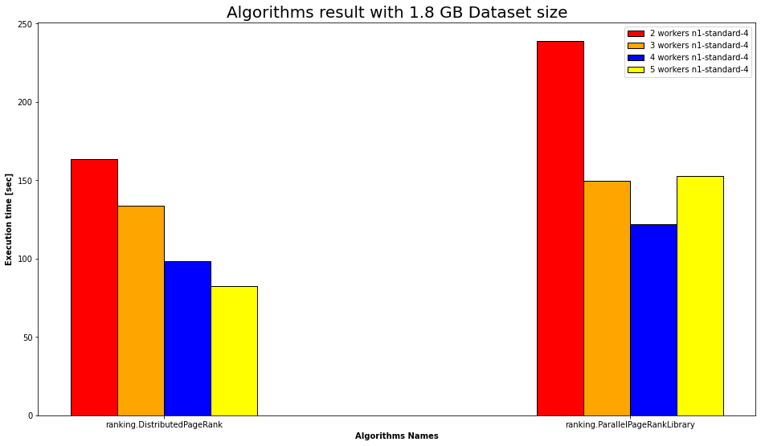

# CovidPubRank
<p>
  
  
</p>

Project for the course "Scalable and Cloud Programming" of the University of Bologna, A.Y. 2021/2022.  
The project aims at implementing library PageRank and custom PageRank algorithms exploiting the MapReduce paradigm.

# Introduction
The purpose of the project was to implement a page rank application of scientific articles concerning Covid-19.  
Different size of datasets and clusters were being used to test weak scalability of distributed Page Rank algorithms.\
Also for testing strong scalability we used to scaling in cluster size comparing distributed algorithms on a large dataset.  
We used Google Cloud Platform (GCP) which allowed us to increase the performances by adding or removing resources from the system.

# Steps
The implementation of our application is mainly composed by three steps:

* Loads a graph's list of edges from a given file path
* Loads node labels from a given file path
* Page rank computation

## Loads a list of edges from a given file path

A <b>list of edges</b> is define as a pairRDD (RDD[(Int, Int)] ) each of which is composed by two integers: the first one identifies the current node's id and the second one represents the outcome node's id.

## Loads node labels from a given file path

Each <b>node</b> is define as a pairRDD (RDD[(Int, String)]) each of which is composed by an integer and a string: the first parameter identifies the node's id and the second one represents the name of the scientific article.

## Page rank computation

To execute page rank computation we have used two different classes of algorithms:
* Sequential algorithms, executed on a single node
* Distributed algorithms, executed in parallel on different nodes

### Sequential algorithms
This class of algorithms computes the contribution for each node in a sequential way (one by one) so if the size of the datasets grows up the computation time increases linearly.
The RDDs of nodes and edges were been transformed into a <b>List[(Int,Int)]</b> or a <b>Graph[(Int,String),String]</b>, depending on the type of the algorithm, before the start of the computation.\
It was been used two different sequential algorithms: an our custom PageRank and a library PageRank.\
The first one computes the ranking in a normalize way and after ten iterations returns the rank list as result. The second one computes the ranking by using a Graph stucture and returns a not normalize rank list as result.


###  Distributed algorithms

In this class of algorithms has been used the resilient distributed dataset (RDD), which is a collection of elements partitioned across the nodes of the cluster that can be operated on in parallel.\
Our distributed algorithm starts with the creation of "outEdges", namely the out edges' data structure computes by grouping source common nodes to their outgoing ones. This structure has type <b>RDD[(Int, Iterable[Int])]</b>.\
It has been defined a second data structure: <i>pageRank</i>, which has type <b>RDD[(Int, Float)]</b> and contains the initial contributions for each node (1 / NumOfNodes).\
To increase performance the "pageRank" structure has been partitioned, for the parallel computation, with an RangePartitioner which takes a single argument: "<i>numPartitions</i>" to define the number of partitions.\
For each iteration "outEdges" and "pageRank" are joined together in order to get for each source node its destination ones and the relative rank value. Then is performed a <i>flatMap</i> operation in order to get all destination nodes and assign to them the contribution part computes by this formula <b>(sour. node rank val. / num. dest. nodes)</b>.\
Once the iteration start finishing the action reduce is performed and the RDD pageRank's value is updated based on page rank formula.\
The computation of the distributed ranking algorithms is executed through parallelization, spreading the computation of the contributions across the workers.

## Spark Session configuration

For handling Spark Context parameters, we create a Spark Session and set values for "spark.default.parallelism" 
parameter, indicating default number of partitions in RDDs used by transformations like 
join or reduceByKey. We create SparkContextSingleton object specifying master type (mandatory) and 
number of RDD partitions and get SparkContext inside Main class.

## Instruction for running project on local environment

You can run Main program by specifying <b>Spark master type</b> (mandatory), <b>algorithmName</b> 
parameter choosing the ones you can find inside ranking folder (default PageRank), <b>inputFilePath</b>
you can find inside data folder, <b>outputFilePath</b>, <b>parallelism</b> specifying RDD partition number (default 4),
<b>mode</b> parameter which stands for execution environment (local, localOnCloud, distributedOnCloud) 
and finally <b>distributedWorkers</b> useless in local environment (optional).  

# Cloud execution on GCP 

To test the algorithms on Google Cloud Platform, the first step is create a Google Cloud project.
Then consider enabling the following services for the previously created project:

- Dataproc
- Cloud Storage

Moreover, it is necessary enable billing for the project.
We suggest installing the Google Cloud SDK for CLIs in your system for using GCP, instead using Google
Cloud Platform console. Do so following [this guide](https://cloud.google.com/sdk/docs/install).
Once you have completed all previous steps, you can manage buckets, clusters and jobs using google 
Cloud SDK for CLIs or open our Colab notebook available on this repository.

### Creating buckets and datasets uploading
All files for the project (JAR executables and TXT datasets) need to be stored in a Cloud Storage bucket.
Access to the tar archive containing all the different datasets in the data folder, extract and publish them to the bucket, once it is created.
Import the project in sbt, generate the JAR file of the project and copy it to another bucket. Then 
remember to create the bucket for Page Rank algorithms output, too.
```
gsutil mb -l $REGION gs://$BUCKET_NAME
```
`$REGION` and `$BUCKET_NAME` can be environment variables, or you can just substitute them with the actual value.
Regions can be found [here](https://cloud.google.com/about/locations).
Beware the bucket name must be unique in the whole Google Cloud Platform, not only in your account.

### Provisioning cluster 
```
gcloud dataproc clusters create $CLUSTER_NAME --region $REGION --zone $ZONE --master-machine-type $MASTER_MACHINE_TYPE --num-workers $NUM_WORKERS --worker-machine-type $WORKER_MACHINE_TYPE
```

Again, you can use environment variables or substitute them with values. The meaning of these variables is the following:

- `$CLUSTER_NAME` is the name of the cluster, you may choose one.
- `$REGION` and `$ZONE`, please follow the link in the section above.
- `$MASTER_MACHINE_TYPE` and `$WORKER_MACHINE_TYPE` can be specified by chosen one of machine types available in this list.
- `$NUM_WORKERS` is the number of total workers (the master is not included in this number) the master can utilize.

We suggest provisioning more than one cluster, at least one single node cluster for testing all algorithms, specifically 
not distributed ones and another one cluster with at least two worker nodes. Please considering limitations on resources 
available for cluster nodes based on machine types chosen (CPUs number, disk size, etc.).

### Compiling the project and uploading the JAR file to the bucket in Cloud Storage
```
sbt clean package
gsutil cp target/scala-2.12/covidpubrank_2.12-0.1.0-SNAPSHOT.jar gs://$BUCKET_NAME/covidpubrank_2.12-0.1.0-SNAPSHOT.jar
```
`$BUCKET_NAME` shall be the one used in the sections above for project jar file.

### Submit a job in Dataproc
```
gcloud dataproc jobs submit spark [--id $JOB_ID] [--async] --cluster=$CLUSTER_NAME --region=$REGION \
--jar=gs://$BUCKET_NAME/covidpubrank_2.12-0.1.0-SNAPSHOT.jar \
 "$MACHINE_CONFIG" "$PAGERANK_ALG" "gs://$DATASET_BUCKET_PATH" "gs://$OUTPUT_BUCKET" "Number_of_RDD_partition" \
 "Environment_execution" "distributedWorkers"
```
Use `--async` if you want to send the job and not wait for the result. The meaning of these variables is the following:
- `$JOB_ID` may be chosen freely, it is just for identification purposes.
- `$CLUSTER_NAME`, `$REGION` are those defined in the above sections.
- `$BUCKET_NAME` stands for the bucket containing the jar file of the project
- `$MACHINE_CONFIG` may be equal to "single-node", "2-worker", "3-worker" or "4-worker" and other configurations defined
in .env file (create and define new machine configuration .env file).
- `$PAGERANK_ALG` indicates the Page Rank algorithm desired for the execution (choose not distributed algorithms in 
combination with single-node cluster and vice-versa for multi-node cluster). Available algorithms are "PageRank", 
"PageRankLibrary", "DistributedPageRank" and "ParallelPageRankLibrary".
- `$DATASET_BUCKET_PATH` identifies the path to the bucket containing the chosen dataset  (available datasets are
"dataset_9647.txt", "dataset_14924.txt", "dataset_32685.txt", "dataset_1015681.txt").
- `$OUTPUT_BUCKET_PATH` is the path to the sub-folder of the bucket designated for storing the file including statistics 
of algorithms. Choose different paths for each job or delete before using them again, although you will have an error. 
- `Number_of_RDD_partitions` ("16" for example).
- `Environment_execution` specifying environment execution name for output file generation ("localOnCloud", "distributedOnCloud").
- `DistributedWorkers` indicating information about cluster and machine types for plotting statistics purpose
  (you can just put "0", "two_workers_n1_standard_4", "two_workers_n1_standard_8", "four_workers_n1_standard_4", "five_workers_n1_standard_4")

### Delete cluster
Gcloud offers commands for delete clusters, list jobs in execution and executed and also delete them.
```
!gcloud dataproc clusters delete $CLUSTER_NAME \
    --region=$REGION
```
Again, you can use environment variables or substitute them with values. The meaning of these variables is the following:
- `$CLUSTER_NAME` and `$REGION` are those defined in the above sections.

### Delete jobs
You can delete all terminated jobs by using the following command:
```
!gcloud dataproc jobs delete $JOB_ID
```
- `JOB_ID` of the job you want delete

## Strong and weak scalability

It is possible submit different jobs on more than one cluster to obtain the execution times of our Page Rank algorithms 
and compare them to see the project scalability. In particular:
- <b>Strong Scalability</b> shows Spark scalability of multiple Dataproc cluster, varying in number of worker nodes, 
for a dated dataset. We suggest testing single-worker, two-worker and four-worker cluster by submitting jobs choosing 
larger datasets to see performances.
- <b>Weak Scalability</b> focuses on scalability on cluster by increasing the number of workers and, at the same time,
scaling on the size of datasets. In case of larger datasets, we suggest using no-single-worker clusters and distributed algorithms for 
better performances.

## Plot statistics

### Weak Scalability

Weak Scalability statistics from a Cloud execution comparing available PageRank algorithms varying on 
different dataset. Execution times in seconds in logarithm scale.


As you can see, statistics of sequential algorithms are omitted, since they are not so interesting
in comparison to the results of the distributed algorithms. Execution times in seconds.

### Strong Scalability
Strong Scalability statistics from a Cloud execution comparing available distributed PageRank algorithms changing on workers. 
Execution times in seconds.



### Vertical Scalability

Vertical scalability means scaling on the number of vCPUs and memory for clusters of the same 
amount of worker. In this case we compare the distributed algorithms on two-worker cluster
with, respectively, 4 vCPUs and 8 vCPUs for worker.


---
### Colab notebook

Prerequisites for using the notebook:
- Allow Colab to access your Google account
- Allow Colab to access Google Drive service (just for using environment variables, it's optional)

Once created a project on GCP, enabled Google services cited in above section and billing option for the project,
it is possible open Colab notebook available in this repository using your logged-in Google account and perform almost steps
described in the "Cloud execution on GCP" section. You can choose if upload a file on Drive describing
the environment variables that will be used on the notebook (obviously modify them or add new ones), or just replace variables with correct values.
In this Colab notebook it is possible create buckets and upload jar file and datasets of the project into them,
create cluster and submit jobs to test strong and weak scalability, delete cluster and jobs once getting
statistic of algorithms and finally plot them using specific python script.
